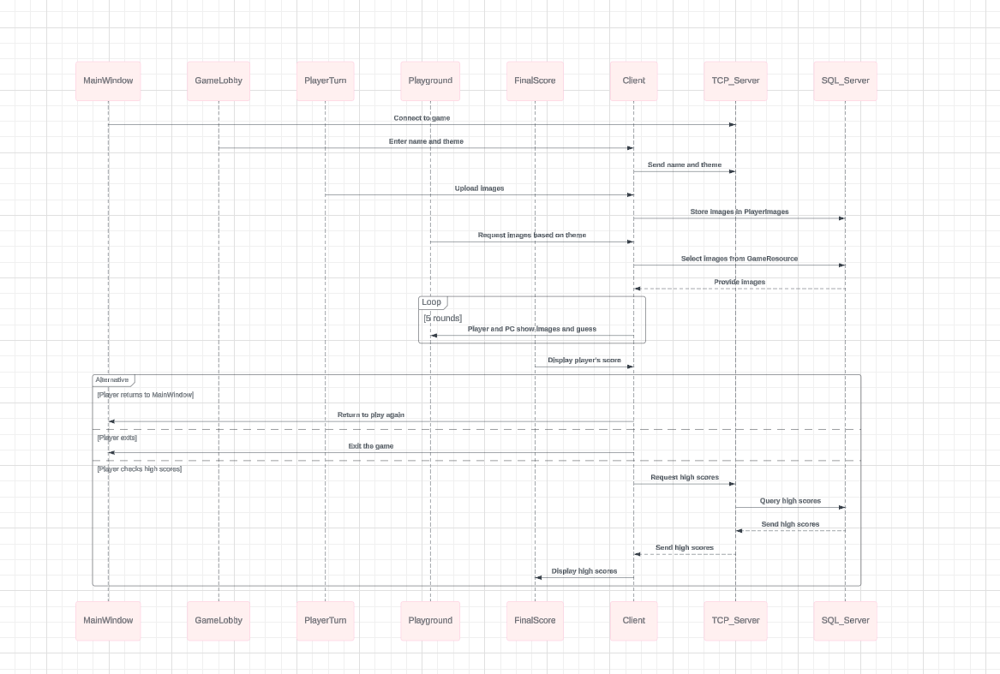
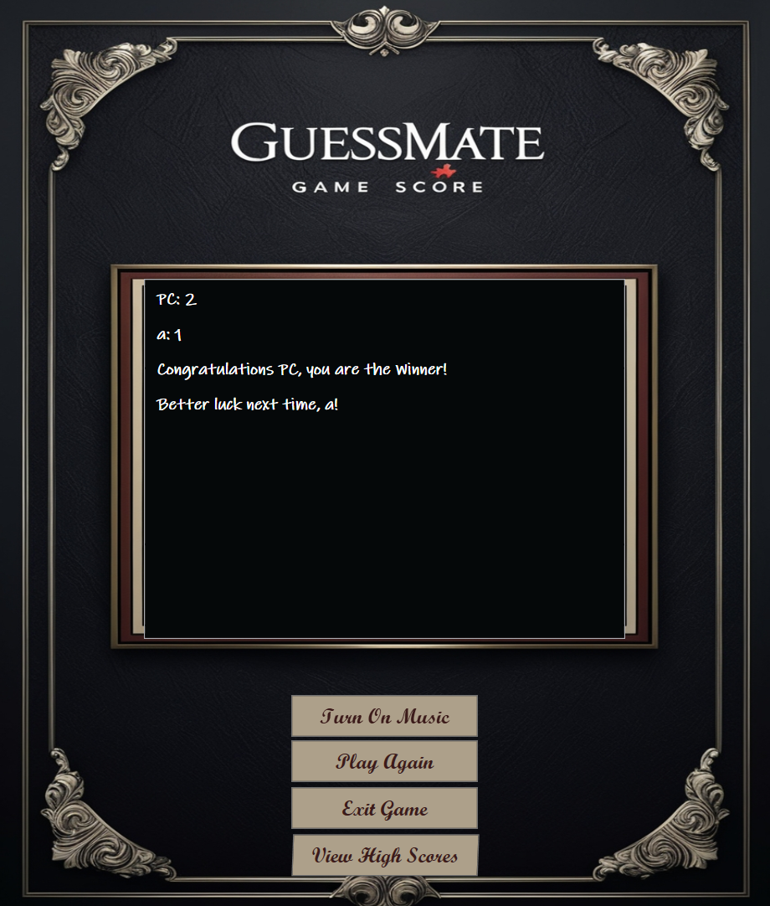

# GuessMate Design Document

## Section 1 - Project Description

### 1.1 Project

**Project Name**: GuessMate

### 1.2 Description

GuessMate is an interactive, turn-based game where players upload images and provide hints for others to guess. The game currently supports a single-player mode where players compete against the computer. The game includes multiple stages: selecting the number of players, entering names, selecting a game theme, uploading images, gameplay, and displaying final scores. The system includes two databases—one for computer-selected images and another for player-uploaded images. Multiplayer logic is planned for future updates.

### 1.3 Revision History

**Change Log**

| **Date**       | **Comment**                                      | **Author**           |
|----------------|--------------------------------------------------|----------------------|
| 2024-10-30     | Initial draft                                    | Parveen Kaur Maan    |
| 2024-11-05     | Added `GameResourcesDB` table structure          | Parveen Kaur Maan    |
| 2024-11-08     | Improved database schema for `PlayerImagesDB`    | Parveen Kaur Maan    |
| 2024-11-12     | Implemented single-player mode in `GuessMate`    | Parveen Kaur Maan    |
| 2024-11-15     | Updated `PlayerImagesDB` with `ImagePath` field  | Parveen Kaur Maan    |
| 2024-11-18     | Focused on single-player mode with PC            | Parveen Kaur Maan    |
| 2024-11-22     | Introduced dynamic theme selection               | Parveen Kaur Maan    |
| 2024-11-25     | Finalized scoring system and game logic          | Parveen Kaur Maan    |
| 2024-11-30     | Final review and documentation improvements      | Parveen Kaur Maan    |

## Section 2 - Overview

### 2.1 Purpose

The purpose of GuessMate is to offer an interactive gaming experience where players can test their memory and guessing skills. The intended audience includes casual and competitive gamers looking for a unique, image-based guessing game.

### 2.2 Scope

The scope includes setting up a client-server model for single-player mode (against the computer), UI interfaces for game interaction, player image uploads, database management for image storage, and functions for managing game state and player scores. Multiplayer functionality is planned for future updates.

### 2.3.1 Functional Requirements

- **R1**: Allow players to choose the number of participants through MainWindow.
- **R2**: Enable entering player names and selecting themes in GameLobby.
- **R3**: Allow players to upload images and hints in PlayerTurn.
- **R4**: Implement gameplay where images and hints are displayed in PlayGround.
- **R5**: Display final scores at the end of the game in FinalScores.
- **R6**: Use `AddImagesToDatabase` for computer image storage.
- **R7**: Use `PlayerImageDatabase` for storing player-uploaded images.
- **R8**: Implement client-server communication for tracking and displaying high scores.
- **R9**: Manage gameplay state, rounds, and turns through GameSession.

### 2.3.2 Non-Functional Requirements

- **Performance**: The system should maintain smooth performance for the single-player game against the computer.
- **Usability**: Ensure the UI is easy to navigate, with clear prompts and controls.
- **Reliability**: The game should handle player disconnections and errors gracefully.

### 2.3.3 Technical Requirements

- **Language**: C#
- **Framework**: .NET, WPF for UI
- **Databases**: Two SQL Server databases—one for computer-selected images and one for player-uploaded images.

### 2.3.4 Security Requirements

- Data encryption during client-server communication.
- Restrict database access to authorized functions within the application.

### 2.3.5 Estimates

| **Description**                    | **Hrs. Est.** |
|-------------------------------------|---------------|
| Game logic implementation           | 40 hrs        |
| UI Design and Integration           | 25 hrs        |
| Testing and Debugging               | 15 hrs        |
| Documentation and Final Adjustments | 5 hrs         |
| **TOTAL**                           | **85 hrs**    |

### 2.3.6 Traceability Matrix

| **SRS Requirement** | **SDD Module**               |
|---------------------|------------------------------|
| R3                  | PlayerTurn.cs, ImageUploadData.cs |
| R9                  | GameSession.cs               |
| R8                  | GameClient.cs, GameServer.cs  |

## Section 3 - System Architecture

### 3.1 Overview

The system follows a client-server architecture for single-player gameplay, where a client communicates with the server to manage game states and high scores. The server handles the game logic and stores data such as high scores, while the client provides the user interface for the player to interact with the game. The application is divided into distinct modules for each stage of the game: selecting the game mode, entering player names, uploading images, playing rounds, and displaying the final scores.

### 3.2 Architectural Diagrams

- **Data Flow Diagrams**: Show the interactions between MainWindow, GameLobby, PlayerTurn, PlayGround, and databases. Client-server communication logic is responsible for sending high score data to the server, ensuring smooth gameplay and data retrieval.

**Sequence Diagram**  

**ERD Diagram**  

**

## Section 4 - Data Dictionary

| **Table**           | **Field**      | **Notes**                             | **Type**     |
|---------------------|----------------|---------------------------------------|--------------|
| **PlayerImagesDB**  | Id             | Unique identifier for each record     | INT          |
|                     | PlayerName     | Player's name                         | VARCHAR      |
|                     | ImageName      | Name of the uploaded image            | VARCHAR      |
|                     | Hint           | Hint for the uploaded image           | VARCHAR      |
|                     | ImageData      | Byte array of image data              | VARBINARY    |
|                     | ImagePath      | File path for the player-uploaded image | VARCHAR      |
| **GameResourcesDB** | Id             | Unique identifier for each record     | INT          |
|                     | Category       | Image category                        | VARCHAR      |
|                     | ImageName      | Name of the image                     | VARCHAR      |
|                     | ImageData      | Byte array of image data              | VARBINARY    |
|                     | ImageHint      | Hint for computer-selected image      | VARCHAR      |
|                     | ImagePath      | File path for the computer-selected image | VARCHAR      |

## Section 5 - Data Design

### 5.1 Persistent/Static Data

- **Player Images Database (PlayerImagesDB)**: Stores player-uploaded images, associated names, and hints.
- **Game Resources Database (GameResourcesDB)**: Holds images selected by the computer, along with hints and categories.

**Classes**:
- **ImageData**: Manages image paths, names, hints, and conversion to byte arrays for database storage.
- **ImageUploadData**: Facilitates image data handling during the player upload phase.

### 5.2 Logical Data Model

- **GameSession**: Manages current game state, player turns, images for rounds, and scoring.
- **Player**: Stores player details including name, images, and score.

## Section 6 - User Interface Design

### 6.1 User Interface Design Overview

- **MainWindow**: Initial UI for selecting the number of players.
- **GameLobby**: Interface for entering player names and choosing game themes.
- **PlayerTurn**: Screen for players to upload images with names and hints.
- **PlayGround**: The main game screen displaying images and allowing players to guess.
- **FinalScores**: Displays player scores at the end of the game.

### 6.2 User Interface Navigation Flow

MainWindow ➔ GameLobby ➔ PlayerTurn ➔ PlayGround ➔ FinalScores

This is the starting screen where players select the number of participants.

 

GameLobby
In this screen, players enter their names and choose a game theme.

  
  

PlayerTurn
Here, players upload five images with corresponding hints. During the game, others will guess based on these hints.

   

PlayGround
This screen displays one of the images shared by a player for others to guess.

   

Final Score
This Screen displays final scores of the game.

 

## 6.3 Use Cases / User Function Description

- **PlayerTurn**:  
  Allows players to upload images and provide hints.

- **GameLobby**:  
  Sets up the game session by taking player details and theme selection.

- **FinalScores**:  
  Displays final player scores after the game ends.

---
________________________________________
### Section 7 - Testing

#### 7.1 Test Plan Creation
- **Objective**: Validate that all functions, including image upload, database integration, and single-player gameplay, work correctly.
- **Scope**: Test individual modules, database interactions, and UI responsiveness.

#### Sample Test Cases

| **Test Case**               | **Input**                             | **Expected Output**                                    |
|-----------------------------|---------------------------------------|--------------------------------------------------------|
| **Image Upload Validation**  | Image with valid name and hint        | Image preview updated, and data stored in the database |
| **Single-Player Mode**       | Single player selected and images uploaded | Game plays correctly with a computer opponent          |
| **Game State Management**    | Complete a round                      | Correct player turn updates and score displayed        |

________________________________________
## Section 8 - Monitoring

- Monitor CPU load, memory usage, and response time on the server, especially during multiplayer gameplay.

## Section 9 - Other Interfaces

- SQL Server integration for image data storage.

## Section 10 - Extra Design Features / Outstanding Issues

- Potential addition of more interactive themes or single-player challenges.

## Section 11 – References

- C# documentation, WPF tutorials, SQL Server integration guides.

## Section 12 – Glossary

- **WPF**: Windows Presentation Foundation

  
- **ENUM**: Enumeration type in C# used for GameMode and GameState  
- **ERD**: Entity-Relationship Diagram  
- **DFD**: Data Flow Diagram  
- **UAT**: User Acceptance Testing  
- **SRS**: Software Requirements Specification
## Future Plans

- **Multiplayer Mode**:  
  Implement multiplayer functionality, allowing up to 4 players to play the game together. Players will take turns displaying images and guessing answers, with real-time scoring updates.

- **Additional Game Themes**:  
  Expand the game’s theme selection to include new categories such as "Nature", "Science", or "Celebrities", offering more variety for the players.

- **Hint Customization**:  
  Allow players to customize the hint format (e.g., multiple-choice hints or time-limited hints) to make the game more dynamic.

- **Mobile App Version**:  
  Develop a mobile version of the game to make it more accessible and increase its reach.

These features will help enhance the gameplay experience and increase the game's appeal to a broader audience.

## How to Play

1. **Game Setup**:
   - Launch the game and select the single-player mode.
   - Choose the desired theme (e.g., family, Bollywood, Hollywood).
   - Upload five images and provide a hint for each image.

2. **Gameplay**:
   - The game consists of **5 rounds**. In each round, you will display one of your five images along with the corresponding hint.
   - After displaying the image, you will try to guess the names of the images based on the hint you gave.
   - After each round, the game will update your score based on how many correct guesses you made.
   - The game will continue until all 5 rounds are completed.

3. **Final Score**:
   - Once all 5 rounds are completed, the game will show your final score, reflecting how many correct guesses you made.

4. **Single-Player Mode**:
   - You play against the computer, which will also make guesses based on the images and hints, following the same mechanics as described above.

Enjoy the game and challenge yourself to remember and guess as accurately as possible!
