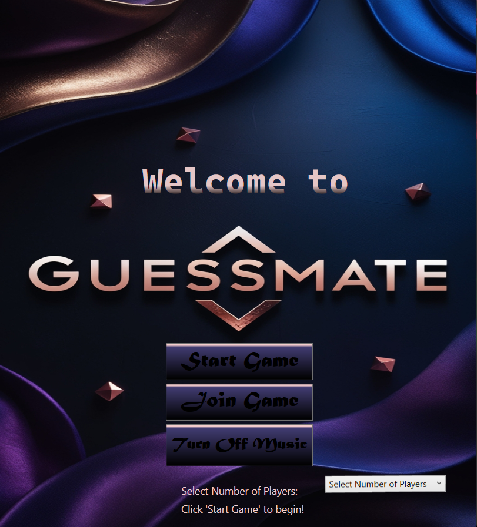
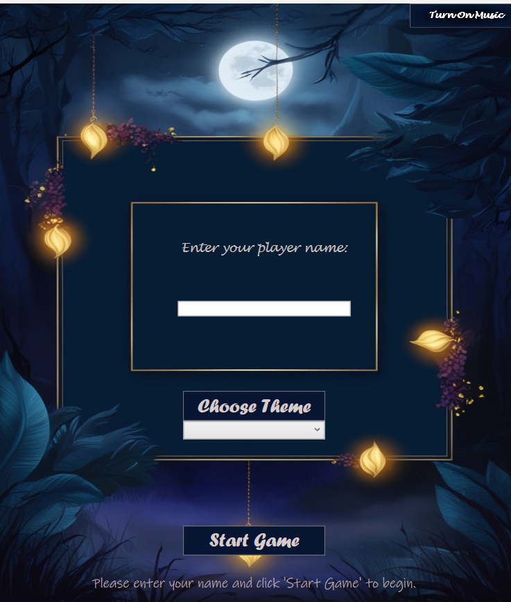
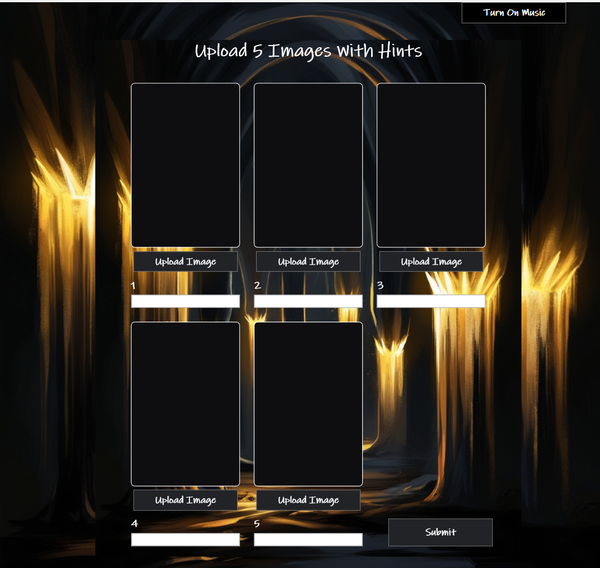
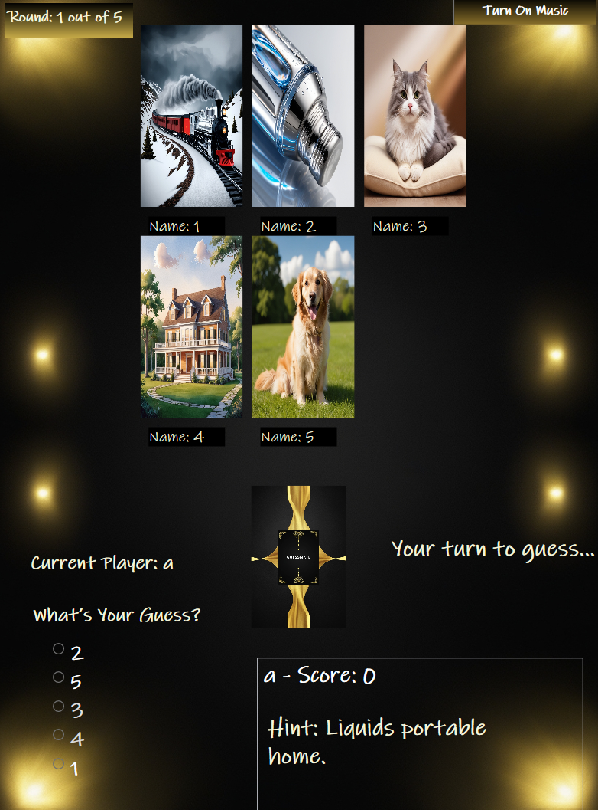

Design Document for GuessMate
Section 1 - Project Description
1.1 Project
•	Project Name: GuessMate
1.2 Description
•	GuessMate is an interactive, turn-based game where players upload images and provide hints for others to guess. It supports single-player mode (playing against a computer) and multiplayer mode (up to 4 players). The game includes multiple stages: choosing the number of players, entering names, selecting a game theme, uploading images, gameplay, and displaying final scores. The system includes two databases—one for computer-selected images and another for player-uploaded images.
•	1.3 Revision History
Date	Comment	Author
30-Oct-2024	Initial draft	Parveen Kaur Maan

Section 2 - Overview
2.1 Purpose
•	The purpose of GuessMate is to offer an interactive gaming experience where players can test their memory and guessing skills. The intended audience includes casual and competitive gamers looking for a unique, image-based guessing game.
2.2 Scope
•	The scope includes setting up a client-server model for multiplayer sessions, UI interfaces for game interaction, player image uploads, database management for image storage, and functions for managing game state and player scores.
2.3 Requirements
2.3.1 Functional Requirements
•	R1: Allow players to choose the number of participants through MainWindow.
•	R2: Enable entering player names and selecting themes in GameLobby.
•	R3: Allow players to upload images and hints in PlayerTurn.
•	R4: Implement gameplay where images and hints are displayed in PlayGround.
•	R5: Display final scores at the end of the game in FinalScores.
•	R6: Use AddImagesToDatabase for computer image storage.
•	R7: Use PlayerImageDatabase for storing player-uploaded images.
•	R8: Support client-server communication for HighCScore game logic.
•	R9: Manage gameplay state, rounds, and turns through GameSession.
2.3.2 Non-Functional Requirements
•	Performance: The system should maintain smooth performance single player game with Computer.
•	Usability: Ensure the UI is easy to navigate, with clear prompts and controls.
•	Reliability: The game should handle player disconnections and errors gracefully.
2.3.3 Technical Requirements
•	Language: C#
•	Framework: .NET, WPF for UI
•	Databases: Two SQL Server databases—one for computer-selected images and one for player-uploaded images.
2.3.4 Security Requirements
•	Data encryption during client-server communication.
•	Restrict database access to authorized functions within the application.
•	2.3.5 Estimates
#	Description	Hrs. Est.
1	Game logic implementation	40 hrs
2	UI Design and Integration	25 hrs
3	Testing and Debugging	15 hrs
4	Documentation and Final Adjustments	5 hrs
TOTAL:	85 hrs	
2.3.6 Traceability Matrix
SRS Requirement	SDD Module
R3	PlayerTurn.cs, ImageUploadData.cs
R9	GameSession.cs
R8	GameClient.cs, GameServer.cs
________________________________________
Section 3 - System Architecture
3.1 Overview
•	The system follows a client-server architecture for multiplayer gameplay, with a server handling connections and a client interface for user interaction. The application has distinct modules for each stage of the game, from selecting players and themes to uploading images and playing rounds.
3.2 Architectural Diagrams
•	Data flow diagrams showing the interactions between MainWindow, GameLobby, PlayerTurn, PlayGround, and databases:

 
Sequence Diagram:
 
Class Diagram
 
________________________________________
Section 4 - Data Dictionary
Table	Field	Notes	Type
PlayerImagesDB	PlayerName	Name of the player	VARCHAR
	ImageName	Name of the uploaded image	VARCHAR
	Hint	Hint for the image	VARCHAR
	ImageData	Byte array of image data	VARBINARY
GameResourcesDB	Category	Image category	VARCHAR
	ImageName	Unique identifier for the image	VARCHAR
	ImageData	Byte array of image data	VARBINARY
	ImageHint	Hint for computer-selected images	VARCHAR
________________________________________
Section 5 - Data Design
5.1 Persistent/Static Data
 
•	Player Images Database (PlayerImagesDB): Stores player-uploaded images, associated names, and hints.
•	Game Resources Database (GameResourcesDB): Holds images selected by the computer, along with hints and categories.
•	Classes:
o	ImageData: Manages image paths, names, hints, and conversion to byte arrays for database storage.
o	ImageUploadData: Facilitates image data handling during the player upload phase.
5.2 Logical Data Model
•	GameSession: Manages current game state, player turns, images for rounds, and scoring.
•	Player: Stores player details including name, images, and score.
________________________________________
Section 6 - User Interface Design
6.1 User Interface Design Overview
•	MainWindow: Initial UI for selecting the number of players.
•	GameLobby: Interface for entering player names and choosing game themes.
•	PlayerTurn: Screen for players to upload images with names and hints.
•	PlayGround: The main game screen displaying images and allowing players to guess.
•	FinalScores: Displays player scores at the end of the game.
6.2 User Interface Navigation Flow
•	MainWindow ➔ GameLobby ➔ PlayerTurn ➔ PlayGround ➔ 
MainWindow
This is the starting screen where players select the number of participants.

 

GameLobby
In this screen, players enter their names and choose a game theme.

  
  

PlayerTurn
Here, players upload five images with corresponding hints. During the game, others will guess based on these hints.

   

PlayGround
This screen displays one of the images shared by a player for others to guess.

   

6.3 Use Cases / User Function Description
•	PlayerTurn: Allows players to upload images and provide hints.
•	GameLobby: Sets up the game session by taking player details and theme selection.
•	FinalScores: Shows final player scores after the game ends.
________________________________________
Section 7 - Testing
7.1 Test Plan Creation
•	Objective: Validate that all functions, including image upload, database integration, and client-server communication, work correctly.
•	Scope: Test individual modules, database interactions, and UI responsiveness.
Sample Test Cases
Test Case	Input	Expected Output
Image Upload Validation	Image with valid name and hint	Image preview updated and data stored
Multiplayer Connection	Valid game code	Client connects and receives confirmation
Game State Management	Complete a round	Correct player turn updates and scores
________________________________________
Section 8 - Monitoring
•	Monitor CPU load, memory usage, and response time on the server, especially during multiplayer gameplay.
Section 9 - Other Interfaces
•	SQL Server integration for image data storage.
Section 10 - Extra Design Features / Outstanding Issues
•	Potential addition of more interactive themes or single-player challenges.
Section 11 – References
•	C# documentation, WPF tutorials, SQL Server integration guides.
Section 12 – Glossary
•	WPF: Windows Presentation Foundation
•	ENUM: Enumeration type in C# used for GameMode and GameState
•	
•	ERD: Entity-Relationship Diagram
•	DFD: Data Flow Diagram
•	UAT: User Acceptance Testing
•	SRS: Software Requirements Specification

For More Details Check The DesignDocument.Docx file.
